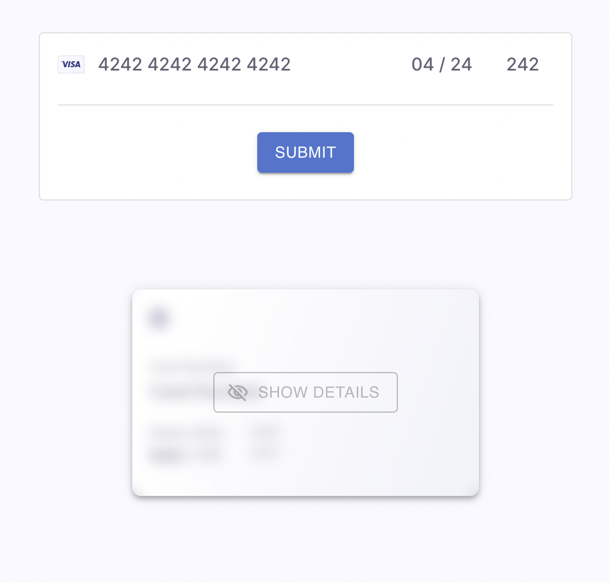
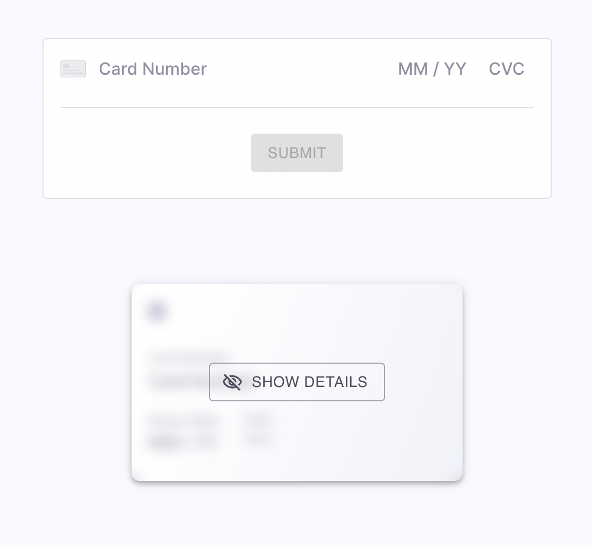
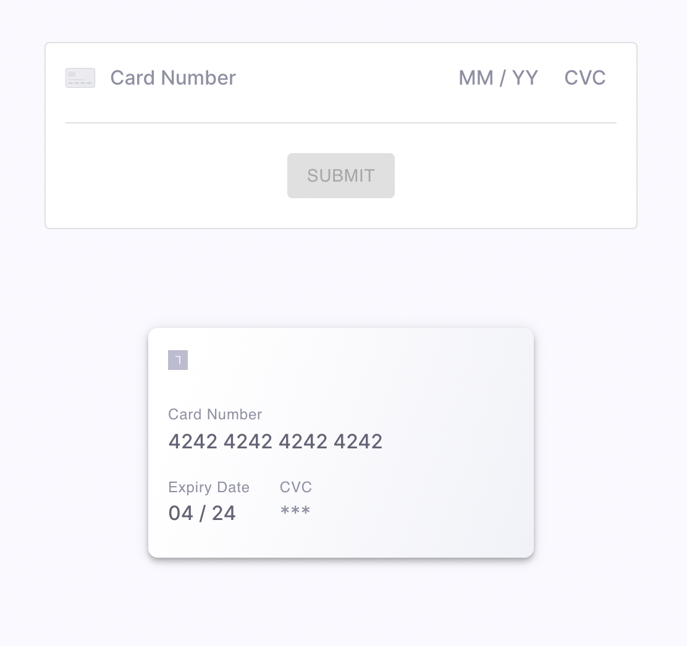

# Display Card Example

This example repository demonstrates how one can securely display Card data back to users, using [Basis Theory Elements React](https://docs.basistheory.com/elements/#react-package).

## 1. Configuration

Create a `.env.local` with your API Keys:

```text
BASIS_THEORY_PRIVATE_KEY=
NEXT_PUBLIC_BASIS_THEORY_PUBLIC_KEY=
```

The Private Application needs to have `token:read` permission on the `/pci/high/` container with `reveal` transform, and it should be able to create `expiring` applications.

The Public Application needs to have `token:create` permission on the `/pci/high/` container.

## 2. Create Card Token

While the goal of this repository is to demonstrate display Card data through secure detokenization, we added a Card input to facilitate the process of creating a new `card` token for displaying later.



## 3. Show Card Data

When the user clicks "Show Details":

1. The React client makes a request to a local `/api/authorize`, passing the recently created token id;
2. The server creates a new `expiring` application and respond with its key;
3. The React client retrieves the token using the received application key;
4. The React client sets the elements value using the returned data;




